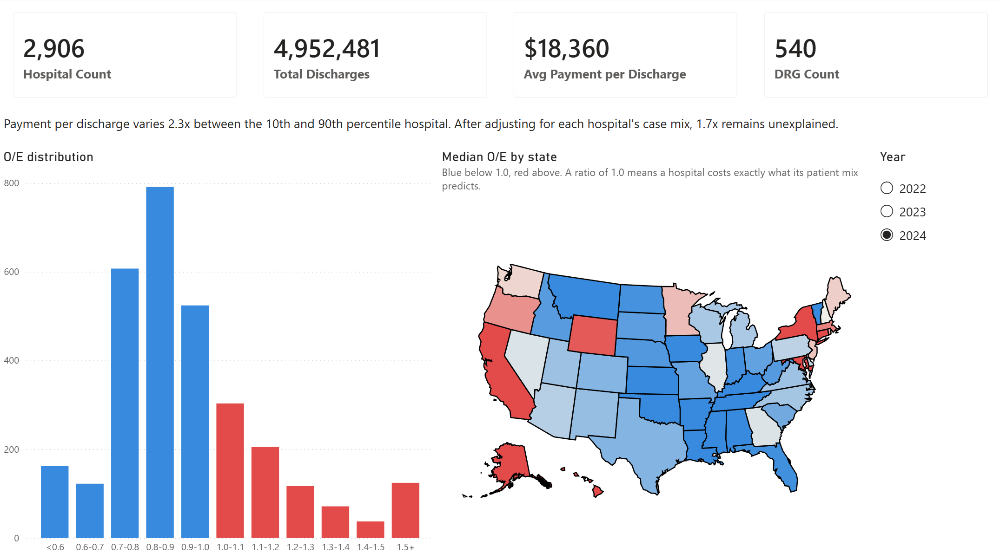
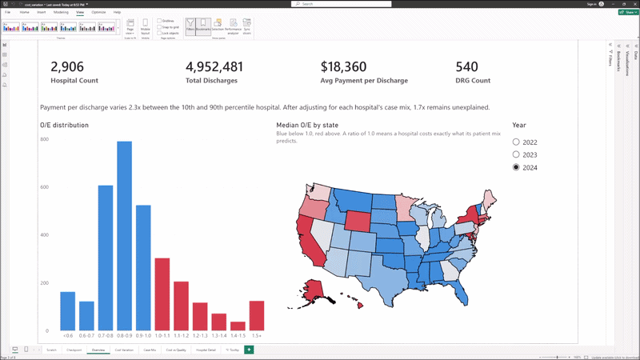
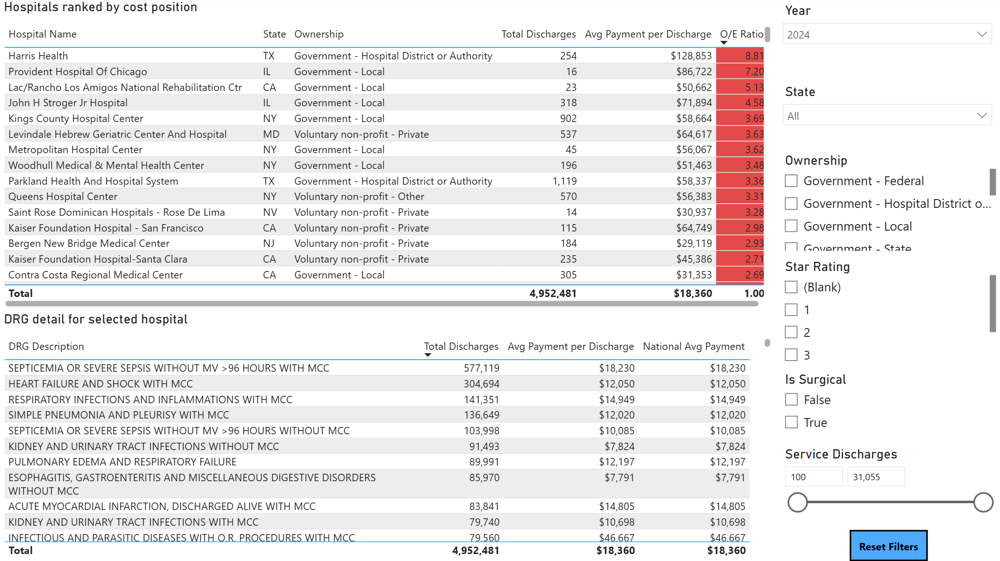
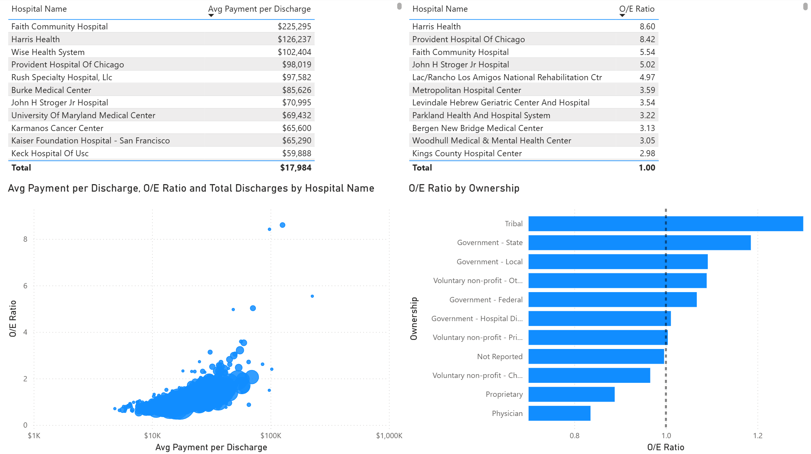
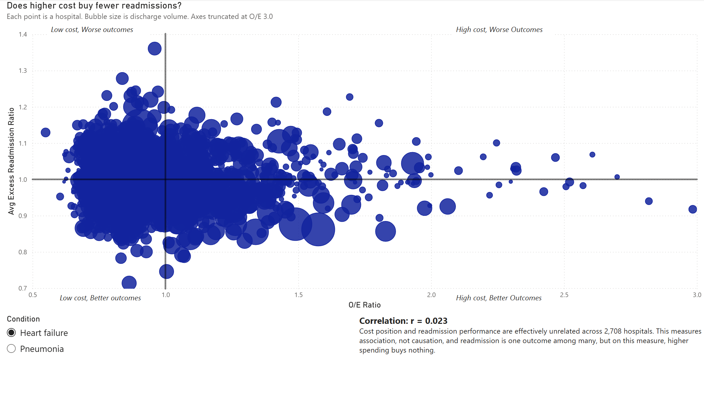
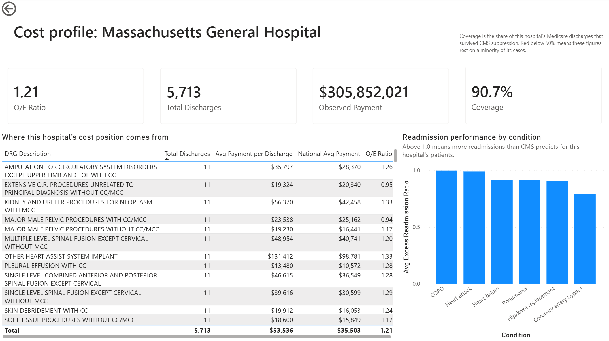

# Medicare Inpatient Cost Variation & Quality



Measuring how much Medicare payment varies across US hospitals for the same
clinical conditions, how much of that variation patient case mix actually
explains, and whether the unexplained portion buys better outcomes.

Built on 438,048 CMS claims records covering 3,063 hospitals and 14.9 million
Medicare discharges across data years 2022 to 2024.

---

## Key findings

**Case mix explains roughly half the variation.** Payment per discharge spans a
p90/p10 ratio of 2.34x across hospitals in 2024, from $10,262 to $24,040. After
adjusting each hospital for its own DRG mix, 1.68x remains unexplained.

**The typical hospital costs less than its case mix predicts.** Median O/E is
0.890 against a national aggregate of exactly 1.000. The distribution is
right-skewed, so a minority of high-cost hospitals accounts for the balance.

**Ownership predicts residual cost, monotonically.** Median O/E runs from 1.139
at state government hospitals down to 0.848 proprietary and 0.754 physician-owned.

**The highest-cost hospitals are public safety-net systems.** The nine highest
O/E ratios in 2024 all belong to major public systems — Harris Health, Parkland,
Cook County, four NYC Health + Hospitals facilities. That is disproportionate
share and uncompensated care payment appearing in the residual, exactly where the
method predicts it would.

**Cost and readmission performance are unrelated.** Across 2,708 hospitals,
correlation between O/E and excess readmission ratio is r = 0.023. Higher
spending does not predict fewer readmissions.

Full detail, including confidence and limitations for each, in
[`docs/findings.md`](docs/findings.md).

---

## Walkthrough



---

## The problem

Medicare pays different amounts to different hospitals for inpatient care. Most
of that difference is explained by which patients each hospital treats. A
hospital doing cardiac surgery costs more than one doing pneumonia admissions,
and that is not a finding.

This project separates the variation explained by case mix from the variation
that is not, then tests whether higher-cost hospitals deliver lower readmission
rates.

**Stakeholder framing:** a payer's network strategy team or a health system's
finance leadership, asking where payment differences reflect efficiency rather
than patient population.

---

## Method

Indirect standardization. For each DRG in each year, compute the national
discharge-weighted average payment. For each hospital, compute what it would be
paid if every DRG performed at that benchmark, given its actual case mix. Divide
observed by expected.

An O/E ratio above 1.0 means the hospital costs more than its patient mix
explains. Quality is measured with the HRRP excess readmission ratio, itself an
observed-over-expected figure, so both axes share a framing.

National O/E validates to **exactly 1.0** by construction, verified to 19 decimal
places in all three years. Expected payment and O/E are computed in DAX rather
than SQL, so both recalculate when a user filters to a subset of DRGs, a state,
or an ownership type.

Full detail, including what the adjustment does *not* remove — IME, DSH, capital,
outlier payments, wage index — in [`docs/methodology.md`](docs/methodology.md).

---

## Dashboard

| Page | Question it answers |
|---|---|
| Overview | How much variation exists, and where? |
| Cost variation | Which hospitals are outliers, and what drives it? |
| Case-mix adjustment | Does adjustment change the picture? |
| Cost vs quality | Does higher spending buy better outcomes? |
| Hospital detail | Where does one hospital's position come from? |






---

## Data

All sources are public CMS data requiring no registration.

| Source | Role | Grain |
|---|---|---|
| [Medicare Inpatient Hospitals by Provider and Service](https://data.cms.gov/provider-summary-by-type-of-service/medicare-inpatient-hospitals/medicare-inpatient-hospitals-by-provider-and-service) | Fact table | hospital × DRG × year |
| [Medicare Inpatient Hospitals by Provider](https://data.cms.gov/provider-summary-by-type-of-service/medicare-inpatient-hospitals) | Validation and coverage | hospital × year |
| [Hospital General Information](https://data.cms.gov/provider-data/dataset/xubh-q36u) | Dimension | hospital |
| [Hospital Readmissions Reduction Program](https://data.cms.gov/provider-data/datasets?theme%5B0%5D=Hospitals) | Quality | hospital × measure |

**Vintages matter.** Data years 2022, 2023, and 2024 come from the RY24, RY25,
and RY26 releases respectively. CMS restates prior years across releases, so
figures reproduce only against these specific vintages.

Raw files are gitignored. See [Reproducing](#reproducing).

---

## Architecture

```
CMS CSV  ->  Python (pandas)  ->  PostgreSQL  ->  star schema  ->  Power BI
```

Cleaning, dimensional modelling, and the national benchmark are computed in SQL.
The semantic layer stays thin: Power Query handles types and naming only, and all
analytical logic lives in DAX measures that respond to user filtering.


**Star schema.** Three dimensions (`dim_hospital`, `dim_drg`, `dim_year`), two
fact tables (`fact_hospital_drg` at 438,048 rows, `fact_hospital_quality` at
17,682), plus a per-DRG benchmark and a hospital-year coverage table. Natural
keys throughout; every fact row resolves to a dimension row, verified.

---

## Repository

```
medicare-analytics/
├── docs/
│   ├── data_dictionary.md        every column, CMS definition + observed values
│   ├── cleaning_decisions.md     every transformation, with reasoning
│   ├── methodology.md            measure selection, O/E method, limitations
│   └── findings.md               six findings with confidence and limitations
├── notebooks/
│   └── profiling.ipynb           structure, keys, types, suppression, validation
├── sql/
│   ├── 01_schema.sql             staging tables
│   ├── 02_quality_checks.sql     load verification, 9 checks
│   ├── 03_dimensions.sql         dim_hospital, dim_drg, dim_year
│   ├── 04_facts.sql              fact tables with foreign keys
│   ├── 05_integrity_checks.sql   star schema verification
│   ├── 06_benchmarks.sql         national DRG benchmark, coverage table
│   └── 07_benchmark_checks.sql   O/E validation, 8 checks
├── src/
│   └── load_postgres.py          typed load with coercion and reconciliation
├── powerbi/
│   └── cost_variation.pbix
└── screenshots/
```

Every SQL file carries expected values as comments. A load that silently drops
rows fails a check rather than producing a plausible dashboard.

---

## Reproducing

**Requirements:** Python 3.11+, PostgreSQL 16+, Power BI Desktop (Windows).

1. Download the four datasets linked above into `data/raw/`. Take data years
   2022 to 2024 for the two claims files.
2. Create the database:
   ```sql
   CREATE DATABASE medicare_analytics;
   \c medicare_analytics
   CREATE SCHEMA staging;
   CREATE SCHEMA analytics;
   ```
3. Copy `.env.example` to `.env` and fill in credentials. **Note:** this project
   uses port **5433**, not the default 5432.
4. `pip install -r requirements.txt`
5. Run `notebooks/profiling.ipynb` to verify the source files.
6. Run `sql/01`, then `src/load_postgres.py`, then `sql/02` through `sql/07` in
   order. Every check should return the value in its comment.
7. Open `powerbi/cost_variation.pbix` and refresh.

Two source-file quirks worth knowing before loading. The RY24 and RY25 releases
are Windows-1252 encoded and fail UTF-8 decoding. CCN, DRG code, and ZIP are all
zero-padded and must be read as strings, or every join silently breaks.

---

## Limitations

**Medicare fee-for-service only.** Medicare Advantage is excluded entirely. MA
now covers roughly half of Medicare enrollment and penetration varies sharply by
market.

**28% of discharges are invisible.** Service-level aggregation recovers 71.8% of
provider-level discharges; the rest sit in cells suppressed below 11 discharges.
Payment impact is small at 1.3%, but a hospital's measured case mix is not
exactly its practised case mix.

**Case-mix adjustment operates at DRG level** and cannot see within-DRG severity.
Outlier payments partly capture that variation and remain in the residual.

**Add-on payments are not separated.** IME, DSH, uncompensated care, capital, and
geographic wage adjustment are all inside total payment and remain after DRG
adjustment. Teaching status is not available in these source files.

**Cost and quality windows differ.** Cost covers data years 2022 to 2024; HRRP
ratios cover 2021-07-01 through 2024-06-30.

**Acute care IPPS hospitals only.** Findings do not generalise to critical access,
psychiatric, or other facility types.

Full list in [`docs/methodology.md`](docs/methodology.md).

---

## License

Analysis code MIT. Underlying data is US government work in the public domain.